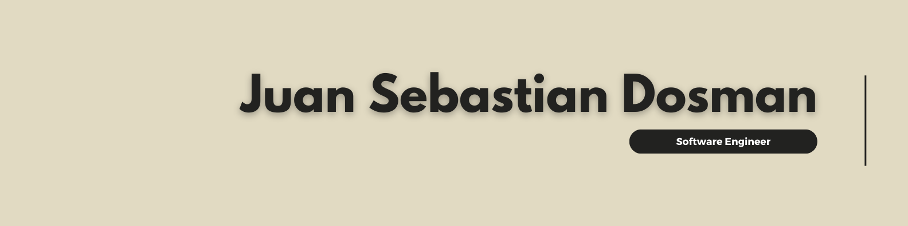

<h2 align="left">Software Engineer | Full Stack | Clean Architecture & Scalable Systems</h2>

- 🧠 Strong foundations in **SOLID principles, Clean Architecture and design patterns**
- 🚀 Experience delivering **production-ready systems** in corporate and freelance environments
- 🏢 Currently working as **Software Engineer Intern at Endava**
- 🎓 Software Engineering student at Universidad de San Buenaventura Cali
- 🌍 Based in Cali, Colombia
- 📬 Contact: **jsdosman0@gmail.com**

## Experience Highlights

- **Endava** – Software Engineer Intern  
  Working on real-world enterprise solutions using modern architectures and agile practices.
- **VortexBird** – Full Stack Developer  
  Developed scalable solutions for financial clients using **Spring Boot, Angular, Keycloak, RabbitMQ**.
- **DTrueStar** – Software Developer  
  Led the migration of legacy systems from **Visual Basic to .NET (C#)** applying clean architecture.
- **Freelance Projects**  
  Designed and delivered full-stack applications with **microservices, WebSockets, cloud deployments and mobile support**.

## My Skill Set

<table>
<tr>
  <td valign="top" width="25%">
    <h3 align="center">Frontend Development</h3>
    
  
      
      
      
        
        
      
      
      
      
      
      
        
        
    

  </td>
  
  <td valign="top" width="25%">
    <h3 align="center">Backend Development</h3>
    

      
      
       
      
      
        
       
        
       
       
      
      
    

  </td>

  <td valign="top" width="25%">
    <h3 align="center">Databases</h3>
    

        
      
        
        
         
    

  </td>

  <td valign="top" width="25%">
    <h3 align="center">Cloud & DevOps</h3>
    
  
       
        
        
        
        
        
      
      
    

  </td>
</tr>
</table>

## Connect With Me

  
  
  

## Contribution Graph

  

